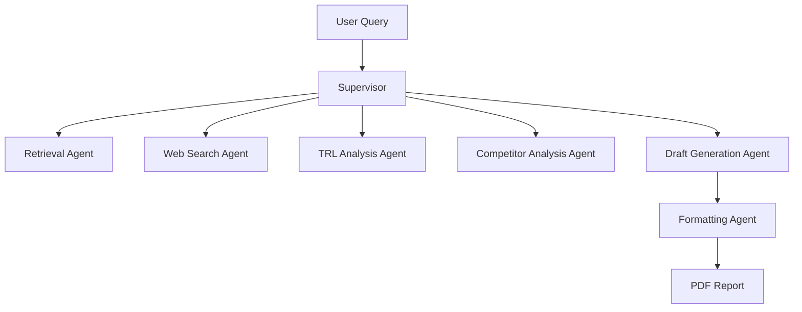

# AI Agent 기반 반도체 기술 전략 분석 시스템

HBM4, PIM, CXL 등 차세대 반도체 기술에 대한 R&D 동향을 수집하고,  
TRL 기반 기술 성숙도 및 경쟁사 분석을 통해 전략 보고서를 자동 생성하는  
AI Agentic Workflow 시스템입니다.

---

## Overview

- **Objective**  
  최신 반도체 기술 정보를 자동 수집·분석하여 R&D 의사결정을 지원하는 전략 보고서를 생성

- **Method**  
  Retrieval 기반 RAG + Web Search + Multi-Agent 분석 + PDF 보고서 생성

- **Tools**  
  LangChain, OpenAI API, FAISS, Tavily, ReportLab

---

## Features

- PDF 논문 기반 정보 추출 (RAG)
- Web Search 기반 최신 기술 동향 반영
- TRL 기반 기술 성숙도 분석
- 경쟁사 전략 및 위협 수준 분석
- Markdown → PDF 자동 보고서 생성
- 표 기반 분석 결과 생성 (TRL / 경쟁사 / 전략)
- 확증 편향 방지 전략:
  - PDF + Web 데이터 병렬 활용
  - 다중 source 기반 cross-check

---

## Tech Stack

| Category   | Details |
|------------|--------|
| Framework  | LangChain, Python |
| LLM        | OpenAI GPT-4o-mini |
| Retrieval  | FAISS(0.88, 0.68) |
| Embedding  | OpenAI Embeddings |
| Search     | Tavily API |
| PDF        | ReportLab |

---

## Agents

- Retrieval Agent: PDF 문서 기반 벡터 검색 수행
- Web Search Agent: 최신 기술 동향 수집 (Tavily API)
- TRL Analysis Agent: 기술 성숙도(TRL) 분석
- Competitor Analysis Agent: 경쟁사 전략 및 위협 수준 평가
- Draft Generation Agent: 분석 결과 기반 보고서 초안 생성
- Formatting Agent: 최종 보고서 구조화 및 정제
- Supervisor Agent: 전체 워크플로우 orchestration

---

## Architecture



---

## Directory Structure

```
├── data/
│   └── papers/            # PDF 논문 데이터
├── agents/                # Agent 모듈
├── utils/                 # PDF 생성, 전처리
├── outputs/               # 결과 파일 (md, pdf)
├── app.py                 # 실행 스크립트
├── requirements.txt
└── README.md
```

---

## How to Run

```bash
python3 -m venv .venv
source .venv/bin/activate
pip install -r requirements.txt
```

```bash
python3 app.py
```

---

## Output

- outputs/final_report.md
- outputs/final_report.pdf
- outputs/run_context.json

---
## Retrieval Evaluation

본 프로젝트에서는 Retrieval 성능을 정량적으로 평가하기 위해 Hit Rate@K와 MRR을 사용하였다.  
직접형 질문과 추론형 질문을 혼합한 QA 세트를 기반으로 평가를 수행하였다.

| Metric        | Score |
|---------------|------|
| Hit Rate@5    | 0.88 |
| MRR           | 0.68 |

- **Hit Rate@5**: Top-5 내 정답 문서 포함 비율
- **MRR (Mean Reciprocal Rank)**: 정답 문서의 평균 순위 역수

본 결과는 단순 키워드 매칭을 넘어 문맥 기반 검색 성능이 효과적으로 작동함을 보여준다.
---
### Error Analysis

일부 실패 케이스는 다음과 같은 원인으로 발생하였다:

- 특정 기술의 TRL 수준과 같은 정보는 명시적으로 문서에 포함되지 않아 keyword 기반 retrieval에서 탐지되지 않음
- 복수 기술 간 비교(예: HBM vs PIM 성숙도)는 단일 문서 retrieval로 해결하기 어려운 추론형 문제임

이는 Retrieval 기반 시스템의 한계로, 향후 LLM 기반 reasoning 단계와의 결합이 필요함을 시사한다.
---

## Contributors

- 황다빈: Agent 설계, RAG 구현, PDF 처리, Web Search 통합
